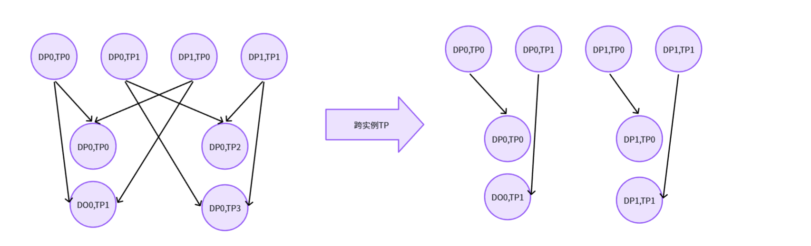
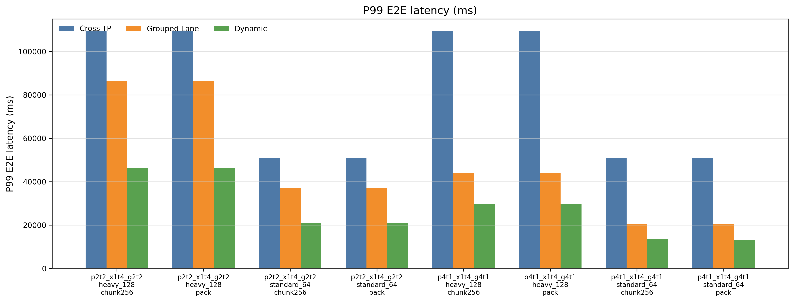
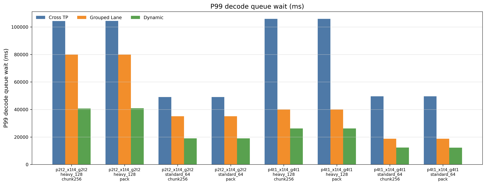
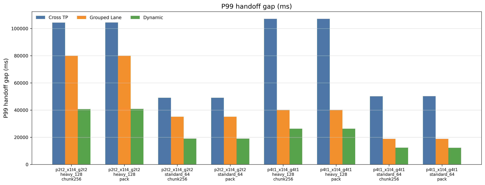
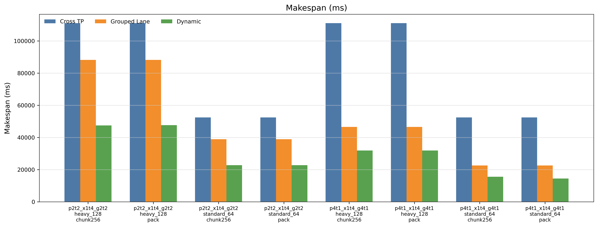
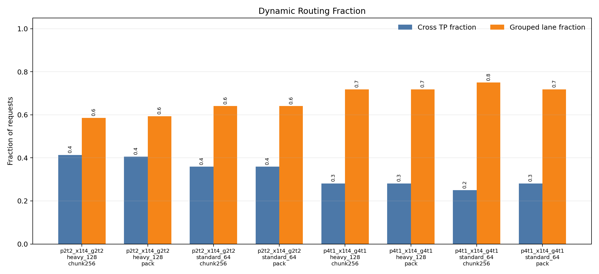
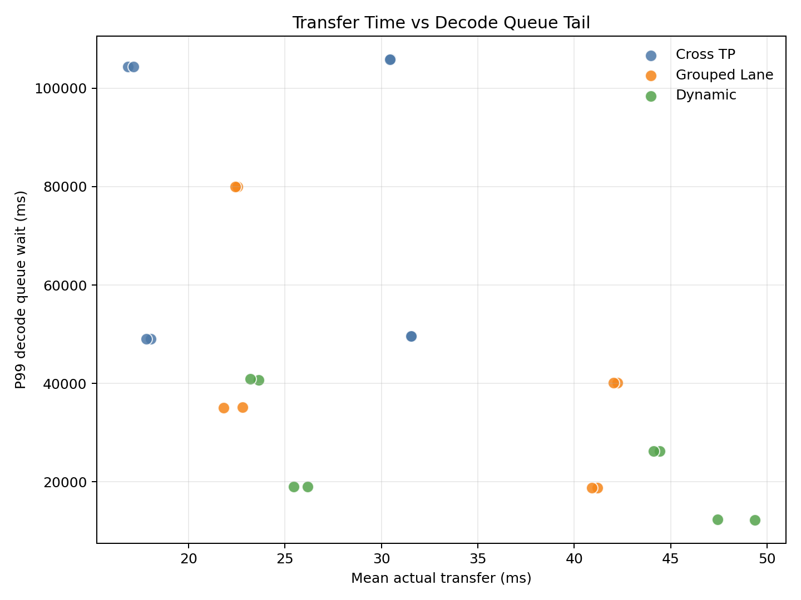
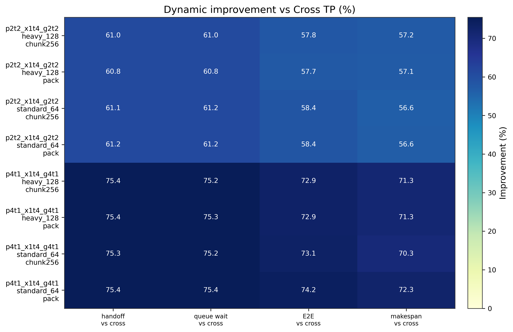

# 问题背景
在LLM serving里，prefill 和 decode 是两个很不同的阶段。
prefill需要TP/SP来分担长上下文计算，或需要DP来提高prompt吞吐
decode需要TP来分担大显存，或者需要DP来分散queue
灵活的需求使得固定并行维度无法同时兼顾吞吐、低延迟和队列隔离

# 情景设定

这对应两种拓扑结构，我们将这两个instance分到0至7个进程，0至3为prefill, 4至7为decode。
左图的拓扑为prefill: 2TP x 2DP -> decode: 4TP x 1DP，命名为cross_tp
右图的拓扑为prefill: 2TP x 2DP -> decode: 2TP x 2DP, 命名为aligned_lane
我们需要看在不同情况下两者动态切换时传输情况。

# 实验思路
## 预建句柄束
在程序启动阶段，把所有可能用到的通信路径、process group、rank 映射、edge 列表提前建好；
运行时某个 request 来了，不再临时建通信拓扑，而是从已经建好的 handle bundle 里选择一条 route 执行。
一个transfer handle大概包含这些信息：
```
handle_name:
  cross_tp / aligned_lane /

topology:
  prefill_dp
  prefill_tp
  decode_dp
  decode_tp
  total_world_size

rank layout:
  哪些 rank 属于 prefill
  哪些 rank 属于 decode

edges:
  每条 KV transfer 边
  src_rank -> dst_rank
  request_dp
  lane_id
  kv_heads range

messages:
  每条 edge 对应要传的 tensor shape / bytes

process_group:
  这个 handle 用哪个通信 group

lane_group_ranks:
  grouped lane 的 rank 列表
```
同时要做好合法性检查。
## P2P peer rank 转换
假如在aligned_lane的[0, 1, 4, 5]通信组里做通信rank0 -> rank4
```
dist.P2POp(dist.isend, tensor, 4, group=lane0_group)  # 可能错
```
因为rank 在这个通信组里的rank其实是2。
这是应该做
```
dst_local = dist.get_group_rank(lane0_group, 4)

dist.P2POp(dist.isend, tensor, dst_local, group=lane0_group)
```
## request-filtered
在实验中发现如果cross_tp如果按照通信组[0,1,2,3,4,5,6,7],实际每个request只能在prefill占用一个DP,比如以DP0举例，真实的通信组应该是[0,1,4,5,6,7],这里如果按8个进程的通信组处理，nccl会hang掉。所以每一种request要单独创建communicator
## workload
这里的benchmark不是一个完整真实的server,但是模拟了request_level_concurrent serving。
request的data_structure为
```
request:
    arrival_ms
    input_len
    output_len
```
而workload分为两种：standard 和 heavy workload
```
standard :                heavy workload:
64 burst requests         128 burst requests
burst_size = 8            burst_size = 16
burst_interval = 180ms    burst_size = 120ms
```
这里不是所有请求均匀到达，而是一批一批冲进系统，制造并发压力。

## prefill和decode时间
这里prefill和decode阶段都是用一种合理的方式进行的估算。
```
prefill_ms = prefill_base + prefill_ms_per_1k * input_len / 1024 + jitter

decode 使用配置的per_token_cost:
cross_tp: decode_ms_per_token 是一个较快的值
aligned_lane: decode_ms_per_token 是一个较慢的值
```
## 时间线维护
核心是维护每类资源什么时候空出来

```
1.arrive_ms :            每个request到达时间，是request成员变量
2.prefill_available[dp]:prefill组里每个DP_lane可以进行prefill的时间戳,初始为零。
3.prefill_end[dp]: prefill组里每个DP_lane prefill完成的时间戳。
4.transfer_start: 完成prefill后开始传输的时间，transfer_start=max(prefill_end, route_transfer_available)
5.route_transfer_available[lane]: 上一个此lane中request传输完成的时间。
6.transfer_end = transfer_start + estimated_transfer_time
7.decode_start = max(transfer_end, decode_avaliable[lane])

```
## online_estimated_transfer_time
由一个著名的公式得 KV btypes 正比于 num_layers x 2 x input_len x hidden_size x dtypes_size
可由此估计传输速率，但是因为我们可以得到通过nccl传输kvcache的真实时间，所以可以对它进行动态调整，那我们又为什么要在这里估计传输时间，主要是为了配合SLO-aware-dynamic-routing算法。
动态调整transfer_time:
```
transfer_time_new = (1 - alpha) * transfer_time_old + alpha * actual_tranfer_time
```
## SLO-aware-dynamic-routing
```
cost(route) =
    transfer_queue_wait(route)
  + estimated_transfer_time(route, input_len)
  + expected_decode_queue_wait(route)
  + expected_decode_compute_time(route, output_len)
  + SLO_penalty(route)
两种拓扑各自得到一种cost，取cost更小的那一种拓扑方式
transfer_queue_wait(route) = transfer_start - prefill_end
expected_decode_queue_wait(route) = decode_start - transfer_end
这里SLO_penalty主要关注decode侧压力：
if handoff_gap = (从prefill_end到decode计算完成时间) > itl_slo_ms
   SLO_penalty = penalty_weights * (itl_slo_ms - handoff_gap)
else 
   SLO_penalty = 0

```

## 传输粒度
为了说明dynamic的结果，或者说aligned_lane的优化不是因为传输粒度变小影响的，我们引入两组实验：
```
1.pack,一次把所有数据传输，即一次把edge传完
2.chunk = 256, 一个edge通过多个message进行传输
```
经分析两种情况dynamic的提升都很显著。

# 实验过程和结果分析

实验在8张GPU上进行，分别测试两种topology：

```

p2t2_x1t4_g2t2:

  prefill: 2TP x 2DP

  decode cross_tp: 4TP x 1DP

  decode aligned_lane_grouped: 2TP x 2DP

  

p4t1_x1t4_g4t1:

  prefill: 1TP x 4DP

  decode cross_tp: 4TP x 1DP

  decode aligned_lane_grouped: 1TP x 4DP

```

每组topology下跑两种workload：`standard_64`和`heavy_128`，同时对比`pack`和`chunk256`两种传输粒度。

每个case比较三种策略：

```

cross_tp: 固定使用cross TP路径

aligned_lane_grouped: 固定使用lane隔离路径

dynamic: 根据当前queue压力和SLO cost动态选择路径

```

  
这里主要看几个指标：

```

1.p99_handoff_gap:

  从prefill结束到decode计算完成的P99时间，反映request在handoff和decode侧被拖住的尾部情况

2.p99_decode_queue_wait:

  transfer结束后等待decode资源的P99时间，直接反映decode queue压力

3.p99_e2e:

  request从到达到decode完成的P99端到端时间

4.makespan:

  整批request全部完成的总时间

5.mean_actual_transfer_ms:

  NCCL实际KV transfer平均耗时，用来区分收益到底来自传输变快还是排队变少

```

  
整体结果如下，dynamic相对`cross_tp`在所有case下都有明显提升。

平均来看，P99 handoff gap降低68.2%，P99 decode queue wait降低68.2%，P99 E2E降低65.7%，makespan降低64.1%。

  



  

上图是P99 E2E latency。可以看到dynamic在所有case下都低于固定`cross_tp`，在`p4t1_x1t4_g4t1`下提升更明显，最好的一组是`p4t1_x1t4_g4t1 / standard_64 / pack`，P99 E2E相比`cross_tp`降低74.2%。

  



  

decode queue wait下降最直接。`p2t2_x1t4_g2t2`下dynamic相比`cross_tp`大约降低61%，`p4t1_x1t4_g4t1`下大约降低75%。这说明主要瓶颈不是单次传输，而是固定`cross_tp`把decode侧排队压力集中到同一条路径上。

  



  

handoff gap和decode queue wait趋势基本一致。dynamic减少了prefill结束后到decode完成之间的尾部等待，也就是减少了request在handoff后被decode侧queue拖住的时间。

  



  
makespan也同步下降，说明dynamic不是只优化少数尾部request，而是对整批burst workload的完成时间也有收益。`p4t1_x1t4_g4t1`下makespan最多降低72.3%。


为了确认dynamic没有退化成固定策略，我们统计了它实际选择两类路径的比例。




  

dynamic中grouped路径比例大约在58.6%到75.0%之间，仍然保留了一部分`cross_tp`路径。因此它不是简单固定走`aligned_lane_grouped`，而是在TP4高吞吐路径和lane隔离路径之间切换。

  



  

这张图用来区分收益来源。dynamic的`mean_actual_transfer_ms`并不是最低，很多case下反而比固定策略更高；但它的P99 decode queue wait明显更低。所以这组实验的核心收益来自queue-aware routing，而不是KV transfer本身更快。

  



  

热力图汇总了dynamic相对`cross_tp`的改进。所有case的主要指标都是正改进，并且`p4t1_x1t4_g4t1`普遍更高。原因是decode lane更细后，lane-level isolation更容易把burst请求分散开，decode queue压力下降更明显。


